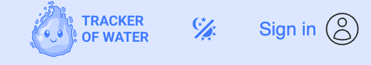
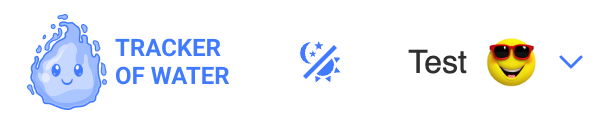

# FR-HEADER: Header Component

## 1. Overview

**Requirement ID: FR-HEADER-001**

Priority: High

Description:

The Header is a persistent UI component that shall be rendered on all pages (public and private) and adapt its content based on user authentication status.

## 2. Shared Header Elements (For Authenticated and Unauthenticated Users)

### 2.1 Theme Toggle Component

**Requirement ID: FR-HEADER-002**

Priority: High

Description:

The Theme Toggle is a UI control that allows users (authenticated or unauthenticated) to switch the application theme between Light and Dark modes.

#### 2.1.1 Display Requirements

**Requirement ID: FR-HEADER-002.1**

Description:

The Theme Toggle shall be:

- Visible in the Header on all application pages
- Accessible to both authenticated and unauthenticated users
- Rendered as a clickable switch control
- Clearly indicating the current theme state (Light or Dark)

#### 2.1.2 Default Theme Behavior

**Requirement ID: FR-HEADER-002.2**

Description:

On initial application load:

- The system shall check localStorage for a saved theme preference
- If a theme value exists in localStorage, that theme shall be applied
- If no theme value exists in localStorage, the Light theme shall be applied by default
- The selected theme shall be saved to localStorage upon change

Acceptance Criteria:

- Given the user opens the application for the first time
- When no theme preference exists in localStorage
- Then the Light theme is applied by default
- And the Theme Toggle displays the Light theme state

#### 2.1.3 Theme Toggle Interaction

**Requirement ID: FR-HEADER-002.3**

Description:

When the user clicks the Theme Toggle:

1. The theme shall switch instantly without page reload:

- From Light to Dark, OR
- From Dark to Light

2. The new theme value shall be saved to localStorage
3. All UI elements shall reflect the new theme

Acceptance Criteria:

- Given the user is viewing any page with the Header
- When the user clicks the Theme Toggle
- Then the theme switches to the opposite theme (Light ↔ Dark)
- And the change occurs without page reload
- And the new theme is saved to localStorage
- And all UI elements update to reflect the new theme

#### 2.1.4 Theme Persistence

**Requirement ID: FR-HEADER-002.4**

Description:

The selected theme shall persist across:

- Browser tab closure and reopening
- Navigation between application pages
- User logout and subsequent return

Acceptance Criteria:

- Given the user has selected a theme
- When the user closes the browser and reopens the application
- Then the previously selected theme is automatically applied

## 3. Header for Unauthenticated Users

### 3.1 Component Composition

**Requirement ID: FR-HEADER-003**

Priority: High

Description: For unauthenticated users, the Header must display three components:

- Logo
- Theme Toggle
- UserAuth button

### 3.2 Logo Component (Unauthenticated)

**Requirement ID: FR-HEADER-003.1**

Priority: High

#### 3.2.1 Display and Interaction

Description:

- The Logo shall display the application's branded logo image
- The Logo shall be rendered as a clickable element (link)
- The Logo shall have appropriate hover/focus states for accessibility
- Alt text shall be provided: "Water Tracker Logo"

#### 3.2.2 Navigation Behavior

Description:

When the Logo is clicked:

- The user shall be redirected to the Welcome Page (route: /welcome)

Acceptance Criteria:

- Given the user is unauthenticated
- And the user is on any public page
- When the user clicks the Logo in the Header
- Then the system redirects the user to the Welcome Page (route: /welcome)

### 3.3 UserAuth Component

**Requirement ID: FR-HEADER-003.2**

Priority: High

#### 3.3.1 Display Requirements

Description:

- The UserAuth element shall be displayed with text "Sign In".
- The UserAuth element shall be visible only to unauthenticated users
- The UserAuth element shall be hidden when user authentication status is detected
- The UserAuth element shall have appropriate hover/focus states for accessibility

#### 3.3.2 Navigation Behavior

Description:

When the UserAuth is clicked:

- The user shall be redirected to the Sign In Page (route: /signin)
- The /signin route shall be publicly accessible (no authentication required)

Acceptance Criteria:

1.

- Given the user is unauthenticated
- When the user views the Header
- Then the UserAuth element is visible

2.

- Given the user is unauthenticated
- And the user is on any public page
- When the user clicks the UserAuth element
- Then the system redirects the user to the SignIn Page
- And the route is '/signin'
- And the Sign In Page component is rendered

## 4. Header for Authenticated Users

### 4.1 Component Composition

**Requirement ID: FR-HEADER-004**

Priority: High

Description:

For authenticated users, the Header shall display three components:

- Logo
- Theme Toggle
- User Logo button

  

### 4.2 Logo Component (Authenticated)

**Requirement ID: FR-HEADER-004.1**

Priority: High

#### 4.2.1 Display and Interaction

Description:

- The Logo shall display the application's branded logo image (same as unauthenticated state)
- The Logo shall be rendered as a clickable element (link)
- The Logo shall have appropriate hover/focus states for accessibility
- Alt text shall be provided: "Water Tracker Logo"

#### 4.2.2 Navigation Behavior

Description:

When the Logo is clicked:

- The user shall be redirected to the Home Page (route: /home)

Acceptance Criteria:

- Given the user is authenticated
- And the user is on any private page
- When the user clicks the Logo in the Header
- Then the system redirects the user to the Home Page (route: /home)

### 4.3 UserLogo Component

**Requirement ID: FR-HEADER-004.2**

Priority: High

#### 4.3.1 Display Logic

**Requirement ID: FR-HEADER-004.2.1**

Description:

The User Logo shall display content according to the following priority order:

Priority 1: If user has both name and avatar:

- Display user's name as text label
- Display avatar image as profile picture

Priority 2: If user has name but no avatar:

- Display user's name as text label
- Display first letter of name (uppercase) as placeholder avatar in a circular container

Priority 3: If user has neither name nor avatar:

- Display truncated email as text label
- Display first letter of email (uppercase) as placeholder avatar in a circular container

Acceptance Criteria:

1.

- Given the user is authenticated
- When the user has an avatar and name
- Then the UserLogo displays the user's name and avatar image

2.

- Given the user is authenticated
- When the user has a name but no avatar
- Then the UserLogo displays the user's name
- And displays the first letter of the name (uppercase) as a placeholder avatar

3.

- Given the user is authenticated
- When the user has neither name nor avatar
- Then the UserLogo displays truncated email as the user's name
- And displays the first letter of the email (uppercase) as a placeholder avatar

#### 4.3.2 Interaction Behavior

**Requirement ID: FR-HEADER-004.2.2**

Description:

The User Logo button shall:

- Be rendered as a clickable button element
- Have appropriate hover and focus states for accessibility

Toggle Behavior:

- First click: Opens User Logo Modal if currently closed
- Second click: Closes User Logo Modal if currently open
- Click outside: Closes User Logo Modal if open

Acceptance Criteria:

1.

- Given the user is authenticated
- And the User Logo Modal is closed
- When the user clicks the User Logo button
- Then the User Logo Modal opens

2.

- Given the user is authenticated
- And the User Logo Modal is open
- When the user clicks the User Logo button again
- Then the User Logo Modal closes

### 4.4 UserLogo Modal Window

**Requirement ID: FR-HEADER-004.3**

Priority: High

#### 4.4.1 Modal Structure

**Requirement ID: FR-HEADER-004.3.1**

Description:

The User Logo Modal shall contain two buttons:

- Settings button - labeled "Settings" with settings icon
- Logout button - labeled "Log Out" with logout icon
- Both buttons shall have hover and focus states

Settings Button Behavior:

- When the Settings button is clicked, the Settings Modal Window shall open

Logout Button Behavior:

- When the Logout button is clicked, the UserLogout Modal Window shall open

Acceptance Criteria:

1.

- Given the user is authenticated
- When the user clicks the User Logo
- Then the UserLogo Modal opens

2.

- Given the user is authenticated
- And the User Logo Modal is open
- When the user clicks the Settings button
- Then the Settings Modal opens immediately

3.

- Given the user is authenticated
- And the User Logo Modal is open
- When the user clicks the Logout button
- Then the User Logout Modal opens immediately

#### 4.4.2 Modal Dismissal

**Requirement ID: FR-HEADER-004.3.2**

Description:

The User Logo Modal shall close when:

- User clicks the User Logo button again
- User clicks outside the modal area

Acceptance Criteria:

1.

- Given the User Logo Modal is open
- When the user clicks the User Logo again
- Then the User Logo Modal closes

2.

- Given the User Logo Modal is open
- When the user clicks outside the modal area
- Then the User Logo Modal closes
