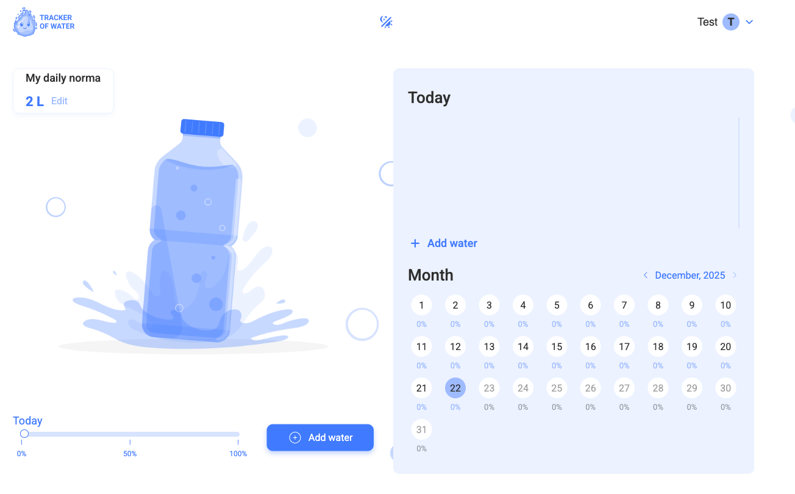

# FR-HOME: Home Page Component

## 1. Overview

**Requirement ID: FR-HOME-001**

Priority: High

Description:

The Home Page is the primary dashboard for authenticated users, providing a comprehensive view of water consumption data including daily goals, current progress, detailed consumption history, and monthly statistics.

Access Control:

- The Home Page is accessible exclusively to authenticated users with verified email addresses
- Access attempts by unauthenticated users shall be redirected to appropriate public pages

Acceptance Criteria:

1.

- Given the user is authenticated
- And the user's email is verified
- And the user's account is active
- When the user navigates to '/home'
- Then the Home Page is displayed
- And all dashboard components are rendered

2.

- Given the user is not authenticated
- When the user attempts to navigate to '/home'
- Then the system detects the lack of authentication
- And the user is redirected to the Welcome Page ('/welcome')
- And no Home Page content is visible during redirect

## 2. Home Page Structure and Layout (For Authenticated Users)

**Requirement ID: FR-HOME-002**

Priority: High

Description:
Upon successful authentication and page access, the Home Page must load all necessary user data to populate dashboard components. The Home Page must contain exactly four primary components arranged in a specific layout that optimizes user experience and information hierarchy.

The Home Page shall consist of four primary containers:

1. Daily Norma: Displays the scheduled daily water intake goal for the current user
2. Water Ratio Panel: Displays the ratio of actual water consumed relative to the daily goal and provides access for adding new records
3. Today Water List: Displays a comprehensive list of all water portions consumed by the user during the current day
4. Month Stats Table: Enables the user to view aggregated water consumption statistics for a selected day of the month

Acceptance Criteria:

- Given the user is on the Home Page
- When the page is fully loaded
- Then the Daily Norma component is displayed
- And the Water Ratio Panel is displayed
- And the Today Water List is displayed
- And the Month Stats Table is displayed
- And all components are in the correct order as specified
