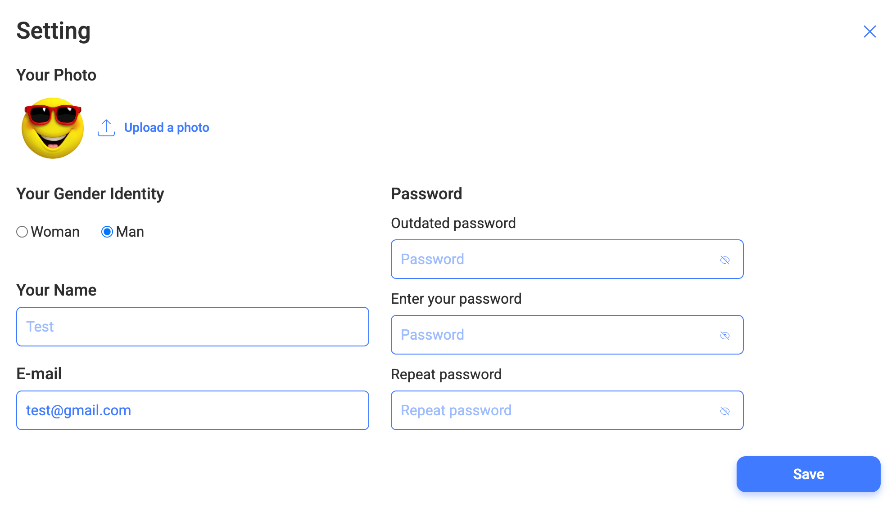

# FR-SETMOD: Setting Modal Component

## 1. Overview

**Requirement ID: FR-SETMOD-001**

Priority: High

Description:

The Settings Modal is a modal dialog component that provides authenticated users with the ability to view and modify their personal profile information including avatar, gender identity, name, email, and password.

Access Path: Header → User Logo Button → User Logo Modal → Settings Button → Settings Modal

Access Control:

1. Users shall meet all of the following conditions to access the Settings Modal:

- User shall be logged in with valid token
- Token shall not be expired
- User's email shall be verified
- User shall be on an authenticated page (/home)
- Header with User Logo shall be visible
- Unauthenticated users cannot access Settings Modal

Acceptance Criteria:

- Given the user is authenticated and on the Home Page
- When the user clicks the User Logo button in the Header
- Then the User Logo Modal opens
- When the user clicks the "Settings" button in the User Logo Modal
- Then the Settings Modal opens

## 2. Setting Modal Structure

**Requirement ID: FR-SETMOD-002**

Priority: High

Description:

The Setting Modal shall contain the following sections:

- Your Photo - Profile picture/avatar display and upload
- Your Gender Identity - Radio button group for gender selection
- Your Name - Text input for user's name
- Email - Text input for user's email
- Password - Password change form with three fields
- Save Button - Form submission button
- Close Button - X icon in top-right corner

Acceptance Criteria:

- Given the Settings Modal is open and loaded
- When the modal is fully rendered
- Then the modal displays the following sections in order:
  1. Your Photo section
  2. Your Gender Identity section
  3. Your Name section
  4. E-mail section
  5. Password section (with 3 fields)
  6. Save button
     And a close button (X) is visible in the top-right corner

### 2.1 Your Photo Section

**Requirement ID: FR-SETMOD-002.1**

Priority: High

Description:

The Your Photo section displays the user's current profile picture and provides functionality to upload a new photo.

The profile picture display shall follow a priority hierarchy based on available user data.

Display Priority Order:

Priority 1 - Avatar Exists:

- Condition: User has uploaded an avatar image
- Display: Show the avatar image

Priority 2 - Name Exists, No Avatar:

- Condition: User has a name but no avatar
- Display: Show first letter of name in uppercase
- Visual: Single letter in circular container. Example: Name "Alice" → Display "A"

Priority 3 - No Name, No Avatar:

- Condition: User has neither name nor avatar
- Display: Show first letter of email in uppercase
- Visual: Same styling as Priority 2. Example: Email "user@example.com" → Display "U"

The "Upload a photo" button allows users to select and upload a new profile picture.
Button Behavior (when clicked):

- Trigger system file picker dialog
- File picker opens with file type restrictions
- User selects image file
- Selected file is validated:
  Allowed File:
  - JPEG: .jpg, .jpeg (image/jpeg)
  - PNG: .png (image/png)
  - WebP: .webp (image/webp)
  - Maximum Size: 5 MB (5,242,880 bytes)
- If valid, upload process begins
- If invalid, error message displayed

UI Updates:

- New avatar displays in Settings Modal
- New avatar updates in Header User Logo (after Save)
- New avatar visible throughout application (after Save)

Acceptance Criteria:

1.

- Given the user has uploaded an avatar image
- When the Settings Modal opens
- Then the Your Photo section displays the user's avatar image
- And the image is displayed in a circular container

2.

- Given the user has a name "Alice" in their profile
- And the user has not uploaded an avatar
- When the Settings Modal opens
- Then the Your Photo section displays the letter "A"
- And the letter is displayed in a circular container
- And the letter is uppercase

3.

- Given the user has no name and no avatar
- And the user's email is "user@example.com"
- When the Settings Modal opens
- Then the Your Photo section displays the letter "U"
- And the letter is displayed in a circular container
- And the letter is uppercase

4.

- Given the Settings Modal is open
- When the user clicks the "Upload a photo" button
- Then the system file picker dialog opens
- And the file picker is filtered to show only image files (JPEG, PNG, WebP)
- And other file types are not selectable

5.

- Given the user selects an image file larger than 5 MB
- When the Settings Modal Save button is clicked
- Then an error message "File too large" is displayed
- And the upload does not proceed
- And the user can select a different file

6.

- Given the user successfully uploads a new avatar
- When the Settings Modal Save button is clicked
- Then the new avatar is visible in the Header User Logo
- And the new avatar is displayed consistently throughout the application
- And the avatar change persists after page refresh

### 2.2 Your Gender Identity Section

**Requirement ID: FR-SETMOD-002.2**

Priority: High

Description:

The Your Gender Identity section provides a radio button group allowing users to select their gender identity.

Gender identity may be used for:

- Calculating personalized daily water intake recommendations
- Statistical analysis
- Personalization features

The section shall contain a radio button group with two options:

- Woman
- Man

Radio Button Behavior:

- Only one option can be selected at a time
- Selecting one option automatically deselects the other

Initial State:

- If no preference has been saved by the user, the "Man" option shall be selected by default.
- If user has saved gender preference, that option is pre-selected

  Acceptance Criteria:

1.

- Given the Settings Modal is open
- When the Your Gender Identity section renders
- Then a radio button group is displayed
- And the group contains exactly two options:
  - "Woman"
  - "Man"
- And each option has a radio button and label
- And only one option can be selected at a time

2.

- Given the user's saved gender identity is "Woman"
- When the Settings Modal loads
- Then the "Woman" radio button is pre-selected

### 2.3 Your Name Section

**Requirement ID: FR-SETMOD-002.3**

Priority: High

Description:

The Your Name section provides a text input field for users to enter or modify their name.

Pre-population:

- Field is pre-filled with user's current name (if exists)
- If no name saved, field is empty

Maximum Length:

- Limit: 32 characters inclusively

Whitespace Handling:

- Trim leading and trailing whitespace before saving

Acceptance Criteria:

1.

- Given the user's saved name is "Alice"
- When the Settings Modal loads
- Then the Your Name field is displayed
- And the field is pre-populated with "Alice"
- And the field is editable
- And the field has a maximum length of 32 characters

2.

- Given the user has no saved name
- When the Settings Modal loads
- Then the Your Name field is empty
- And the field is ready for input

3.

- Given the user enters a name longer than 32 characters
- When the user clicks Save
- Then an error message "Name must be 32 characters or less" is displayed
- And the name is not saved

4.

- Given the user enters " Alice " (with leading and trailing spaces)
- When the user saves the form
- Then the whitespace is trimmed
- And the saved name is "Alice" (no extra spaces)
- And the field displays "Alice" after save

5.

- Given the Your Name field contains "Alice"
- When the user clears the entire field (deletes all text)
- And the user clicks Save
- Then the form saves successfully
- And the user's name is set to empty/null
- And the user's avatar displays email initial (if no other name source)

### 2.4 Email Section

**Requirement ID: FR-SETMOD-002.4**

Priority: High

Description:

The E-mail section displays the user's registered email address. Users shall be permitted to update their email address.

The Email field shall accept only a valid email format values:

- Input Type - Email

Pre-population:

- Field is automatically filled with user's email from registration
- Email is fetched with initial profile data load

Validation Rules:

- Email field shall match standard email format: local-part@domain
- Email field shall contain exactly one @ symbol
- Local part shall not be empty
- Domain must contain at least one dot (.)

- Length Validation:

  - Maximum length: 254 characters inclusive
  - Minimum length: 3 characters inclusive (shortest possible: a@b.c)

- The Email field shall not accept empty values
- Case-insensitive comparison (e.g., User@example.com = user@example.com)
- If the email is invalid:

  - an error message shall be displayed to the user

Acceptance Criteria:

1.

- Given the user's registered email is "user@example.com"
- When the Settings Modal loads
- Then the E-mail field is displayed
- And the field shows "user@example.com"

2.

- Given the user's registered email address is "user@example.com"
- When the user updates the email address to "user2@example.com"
- And the user clicks Save
- Then the form saves successfully
- And the user's email address is updated to "user2@example.com"

3.

- Given the user's registered email address is "user@example.com"
- When the user clears the entire field (deletes email address)
- And the user clicks Save
- Then the form does not submit
- And an error message "Required" is displayed
- And the Email field is marked as invalid

4.

- Given the user's registered email address is "user@example.com"
- When the user updates the email address to invalid email format (e.g., "notanemail")
- And the user clicks Save
- Then the form does not submit
- Then an error message "Invalid email" is displayed
- And the Email field is marked as invalid

### 2.5 Password Section

**Requirement ID: FR-SETMOD-002.5**

Priority: High

Description:

The Password section enables users to change their password by providing their current password and entering a new password twice for confirmation.

The Password section contains three password input fields:

- Outdated password - User's current password for verification
- New password - Desired new password
- Repeat new password - Confirmation of new password

All three fields are required when user wants to change password.

Validation Rules:

1. New password:

- The Password field cannot be empty
- Password length shall be between 8 and 64 characters inclusive

2. Repeat new password:

- Field cannot be empty
- The Repeat New Password value shall exactly match the New Password value
- Comparison is case-sensitive
- Comparison is character-by-character exact match
- Any difference (including spaces) results in validation failure
- If New Password field value changes after Repeat New Password is filled, re-validation shall occur
- In the event of a mismatch:
  - the field shall display an invalid state
  - an error message shall be displayed

The Password field shall mask input text and have "Show/Hide Password" toggle.

Security Consideration: Ensure password is never logged or exposed in debugging tools when visible.

Acceptance Criteria:

1.

- Given the user has modified their name to "Alice"
- And all three password fields are empty
- When the user clicks the Save button
- Then the form submits successfully
- And only the name is updated
- And the password remains unchanged
- And a success notification is shown

2.

- Given the user enters:
  - Outdated password: "OldPass123"
  - New password: "NewPass456!"
  - Repeat new password: "NewPass456!"
- And all entries are valid
- When the user clicks Save
- Then the form validates successfully
- And the user's password is updated in the database

3.

- Given the user enters:
  - Outdated password: "WrongPassword"
  - New password: "NewPass456!"
  - Repeat new password: "NewPass456!"
- When the user clicks Save
- Then an error "Old password is wrong" is displayed
- And the Settings Modal remains open
- And the user can correct and retry

4.

- Given the user enters:
  - Outdated password: "OldPass123"
  - New password: "Short1" (only 6 characters)
  - Repeat new password: "Short1"
- When the user moves focus away from the new password field
- Then an error message "Minimum eight characters" is displayed
- And the new password field is marked as invalid
- And the Save button is disabled or shows error on click

5.

- Given the user fills:
  - Outdated password: "OldPass123"
  - New password: (empty)
  - Repeat new password: (empty)
- When the user clicks Save
- Then an error message "All password fields are required" is displayed
- And the form does not submit

### 2.6 Save Button

**Requirement ID: FR-SETMOD-002.6**

Priority: High

Description:

The Save button is the primary call-to-action that submits all profile changes (avatar, gender, name, email, password) to the backend for persistence.

Button State Management:

- The Save button shall be a submit type button.
- Upon clicking the button:
- An API request shall be sent to the backend to update the user's data.
- If the server returns an error:

  - An error notification shall be displayed with the relevant error message.

- The SettingModal shall remain open to allow for corrections.
- Upon a successful response:

  - A success notification shall be displayed.

- The Setting Modal shall close automatically.
- The updated data shall be reflected across the UI.

Acceptance Criteria:

1.

- Given the user has changed their name to "Alice"
- When the user clicks the Save button
- Then the form validates successfully
- And an API request is sent with the updated name
- When the server confirms the update
- Then the Settings Modal closes
- And a success notification is displayed
- And the Header User Logo displays "Alice"
- And the change persists after page refresh

2.

- Given the user clicks Save with valid changes
- When the API request times out or fails due to network error
- Then an error message is displayed
- And the form data is preserved
- And the Save button is re-enabled
- When the user clicks Save
- Then the save process is attempted again

### 2.7 Setting Modal Dismissal

**Requirement ID: FR-SETMOD-002.7**

Priority: High

Description:
The Settings Modal must provide multiple ways for users to close it, with appropriate handling of unsaved changes. Closing the modal without clicking Save discards all unsaved changes.

The Settings Modal can be closed through four distinct methods:

- Close Button (X)
- Backdrop Click
- Escape Key
- Successful Form Submission

Acceptance Criteria:

1.

- Given the Settings Modal is open
- And the user has made no changes
- When the user clicks the X close button in the top-right corner
- Then the Settings Modal closes immediately
- And the user returns to the previous page

2.

- Given the Settings Modal is open
- When the user clicks on the backdrop area outside the modal dialog
- Then the Settings Modal closes
- And the user returns to the previous page

3.

- Given the Settings Modal is open
- When the user presses the Escape key
- Then the Settings Modal closes
- And the user returns to the previous page

4.

- Given the Settings Modal is open
- And the user has modified the name field
- When the user closes the modal via X button, backdrop, or Escape key
- Then the modal closes and changes are discarded
