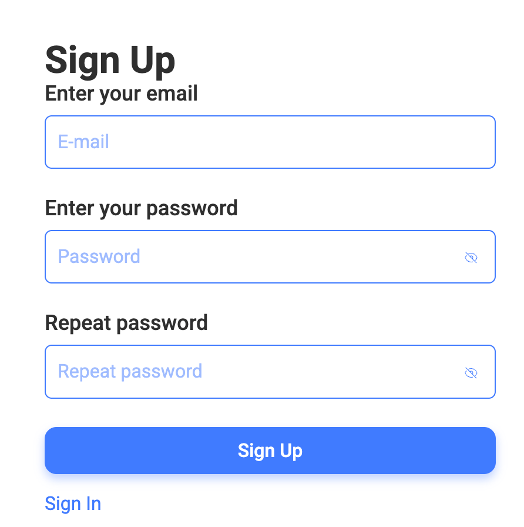

# FR-SIGNUP: Sign Up Page Component

## 1. Overview

**Requirement ID: FR-SIGNUP-001**

Priority: High

Description:

The Sign Up Page is a public registration page that enables new users to create accounts by providing email and password credentials, followed by email verification.

Page Access:

- The Sign Up Page shall be rendered at the /signup route
- The Sign Up Page shall be accessible only to unauthenticated users
- An unauthenticated user shall access the Sign Up Page from the Welcome Page by clicking the Try tracker button.

Acceptance Criteria:

- Given the user is unauthenticated
- And the user is on /welcome
- When the user clicks the Try tracker button
- Then the Sign Up Page is displayed at /signup

## 2. Sign Up Page Structure

**Requirement ID: FR-SIGNUP-002**

Priority: High

Description:

The Sign Up Page layout defines mandatory UI components required for registration.

The Sign Up Page shall contain the following components:

- AuthForm component - registration form with input fields and submit button
- Sign In navigation element - link to redirect existing users to Sign In page

Acceptance Criteria:

- Given the Sign Up Page is loaded
- When rendering is complete
- Then AuthForm component is displayed
- And Sign In element is displayed

### 2.1 AuthForm Component

**Requirement ID: FR-SIGNUP-002.1**

Priority: High

Description:

The AuthForm component is a registration form that collects user credentials, validates input, and submits data to the backend registration API.

The AuthForm shall contain three required fields and one submit button:

- Email: type email, required
- Password: type password, required
- Repeat Password: type password, required
- "Sign Up" submit button

Acceptance Criteria:

- Given the user is on the Sign Up Page
- When the AuthForm is rendered
- Then the Email field is visible and marked as required
- And the Password field is visible and marked as required
- And the Repeat Password field is visible and marked as required
- And the "Sign Up" button is visible

### 2.2 Email Field

**Requirement ID: FR-SIGNUP-002.2**

Priority: High

Description:

The Email field shall accept only a valid email format values.

Validation Rules:

- Email field shall match standard email format: local-part@domain
- Email field shall contain exactly one @ symbol
- Local part shall not be empty
- Domain must contain at least one dot (.)

- Length Validation:

  - Maximum length: 254 characters inclusive
  - Minimum length: 3 characters inclusive (shortest possible: a@b.c)

- The Email field shall not accept empty values
- The email value shall be unique across the system
- Case-insensitive comparison (e.g., User@example.com = user@example.com)
- If the email is invalid or already exists:

  - the field shall display an invalid state
  - an error message shall be displayed to the user

Acceptance Criteria:

1.

- Given the user enters a valid email format (e.g., "user@example.com")
- And the user moves focus away from the Email field
- Then no error message is displayed
- And the Email field is not marked as invalid

2.

- Given the user is on the Sign Up Page
- When the user attempts to submit without entering an email
- Then the form does not submit
- And an error message "Required" is displayed
- And the Email field is marked as invalid

3.

- Given the user is on the Sign Up Page
- When the user enters an invalid email format (e.g., "notanemail")
- And the user moves focus away from the Email field
- Then an error message "Invalid email" is displayed
- And the Email field is marked as invalid

4.

- Given the user enters an email that already exists in the system
- When the user submits the form
- Then the backend returns a validation error
- And an error message "Email in use" is displayed

### 2.3 Password Field

**Requirement ID: FR-SIGNUP-002.3**

Priority: High

Description:

The Password field shall mask input text and have "Show/Hide Password" toggle.

Validation Rules:

- The Password field cannot be empty
- Password length shall be between 8 and 64 characters inclusive
- If validation fails:

  - the field shall display an invalid state
  - an error message shall be shown

Security Consideration: Ensure password is never logged or exposed in debugging tools when visible.

Acceptance Criteria:

1.

- Given the user is on the Sign Up Page
- When the user attempts to submit without entering a password
- Then the form does not submit
- And an error message "Required" is displayed
- And the Password field is marked as invalid

2.

- Given the user is on the Sign Up Page
- When the user enters a password with fewer than 8 characters
- And the user moves focus away from the Password field
- Then an error message "Minimum eight characters" is displayed
- And the Password field is marked as invalid
- And the form cannot be submitted

3.

- Given the user is on the Sign Up Page
- When the user enters a password with more than 64 characters
- And the user moves focus away from the Password field
- Then an error message "Too Long!" is displayed
- And the Password field is marked as invalid
- And the form cannot be submitted

4.

- Given the user is on the Sign Up Page
- When the user enters a password with 8 to 64 characters
- And the user moves focus away from the Password field
- Then no error message is displayed
- And the Password field is not marked as invalid

5.

- Given the user has entered a password
- When the user clicks the "Show password" toggle
- Then the password is displayed in plain text
- And the toggle label changes to "Hide password"

6.

- Given the password is currently visible
- When the user clicks the "Hide password" toggle
- Then the password is masked again
- And the toggle label changes to "Show password"

### 2.4 Repeat Password Field

**Requirement ID: FR-SIGNUP-002.4**

Priority: High

Description:

The Repeat Password field shall mask input text and have "Show/Hide Password" toggle.

Validation Rules:

- Field cannot be empty
- The Repeat Password value shall exactly match the Password value
- Comparison is case-sensitive
- Comparison is character-by-character exact match
- Any difference (including spaces) results in validation failure
- If Password field value changes after Repeat Password is filled, re-validation shall occur
- If passwords don't match after Password field update, error shall be shown
- In the event of a mismatch:

  - the field shall display an invalid state
  - an error message shall be displayed

Acceptance Criteria:

1.

- Given the user is on the Sign Up Page
- When the user attempts to submit without entering a repeat password
- Then the form does not submit
- And an error message "Required" is displayed
- And the Repeat Password field is marked as invalid

2.

- Given the user has entered a password in the Password field
- When the user enters a different value in the Repeat Password field
- And the user moves focus away from the Repeat Password field
- Then an error message "Passwords must match" is displayed
- And the Repeat Password field is marked as invalid
- And the form cannot be submitted

3.

- Given the user has entered a password in the Password field
- When the user enters the same value in the Repeat Password field
- Then no error message is displayed
- And the Repeat Password field is not marked as invalid
- And the form can be submitted (if all other fields are valid)

4.

- Given the user has entered matching passwords in both fields
- When the user changes the Password field value
- Then the Repeat Password field is re-validated
- And if the passwords no longer match, an error is displayed

### 2.5 Sign Up Button Behavior

**Requirement ID: FR-SIGNUP-002.5**

Priority: High

Description:

Primary CTA button on page.

Button State Management:

- Button is disabled when form is invalid or incomplete
- Button is enabled when all validation criteria are met
- When the Sign Up button is clicked (and enabled):
  - Display success message (on successful registration)
  - Display success message, prompting the user to check their email for verification (on successful registration)
  - Display error messages (on registration failure)

Acceptance Criteria:

1.

- Given the user is on the Sign Up Page
- When one or more form fields are empty or invalid
- Then the "Sign Up" button is disabled

2.

- Given all form fields are valid
- When the user clicks the "Sign Up" button
- Then the registration request is successful
- And a success message is displayed to the user
- And a verification message is displayed to the user

### 2.6 Email Verification Flow

**Requirement ID: FR-SIGNUP-002.6**

Priority: High

Description:

The email verification flow ensures that users have access to the email address they registered with, reducing spam accounts and confirming valid contact information. All new accounts shall verify their email address before gaining full access to the application. Unverified accounts have restricted access and cannot use core application features.

Verification Email Sending:

- After successful registration, the system shall automatically send a verification email to the user's registered email address
- Email shall be sent within 30 seconds of successful registration
- The email shall contain a verification link
- If the user does not receive the initial email:

  - the system shall allow resending the verification email

- Upon successful verification:

  - the user shall be automatically authenticated
  - the user shall be redirected to /home

Acceptance Criteria:

- Given the user has successfully completed registration
- When the backend processes the registration
- Then a verification email is sent to the user's email address
- And the email is sent within 30 seconds
- And the email contains a valid verification link
- And the user gains access to the Home Page ('/home')

### 2.7 Sign In Navigation Element

**Requirement ID: FR-SIGNUP-002.7**

Priority: High

Description:

The Sign In navigation element provides a clear path for existing users to access the Sign In Page.

Navigation Behavior:

When the Sign In element is clicked:

- User shall be redirected to the Sign In Page
- Route shall change to /signin
- Sign In Page component shall be rendered

Acceptance Criteria:

- Given the user is on the Sign Up Page
- When the user clicks the Sign In navigation element
- Then the system navigates to '/signin'
- And the Sign In Page component is rendered
