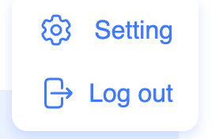

# FR-HEADER: Header Component Requirements

## 1. Header Presence

**Requirement ID: FR-HEADER-001**

Priority: High

User Type: All users

The Header component shall be displayed at the top of every page in the application.

**Acceptance Criteria:**

1. The Header is visible at the top of the viewport on all public pages.
2. The Header is visible at the top of the viewport on all private pages.

## 2. Theme Toggle Requirements

### 2.1. Theme Toggle Visibility

**Requirement ID: FR-HEADER-002.1**

Priority: High

User Type: All users

The Theme Toggle control shall be visible in the Header on all pages.

**Acceptance Criteria:**

1. A theme toggle control is visible in the Header on all pages.

### 2.2. Default Theme Selection

**Requirement ID: FR-HEADER-002.2.1**

Priority: High

User Type: All users

The system shall apply the Light theme by default when no saved theme preference exists.

**Acceptance Criteria:**

1. The Light theme is applied by default when no theme preference exists in localStorage.

**Requirement ID: FR-HEADER-002.2.2**

Priority: High

User Type: All users

The system shall check localStorage for a saved theme preference on application load.

**Acceptance Criteria:**

1. The saved theme from localStorage is applied when the application loads.

### 2.3. Theme Toggle Interaction

**Requirement ID: FR-HEADER-002.3**

Priority: High

User Type: All users

The system shall switch from Light theme to Dark theme when the user clicks the Theme Toggle while Light theme is active. 
The system shall switch from Dark theme to Light theme when the user clicks the Theme Toggle while Dark theme is active. 
The system shall save the selected theme to localStorage after theme change.

**Acceptance Criteria:**

1. Clicking the Theme Toggle while Light theme is active switches to Dark theme.
2. Clicking the Theme Toggle while Dark theme is active switches to Light theme.
3. The new theme value is saved to localStorage after the theme change completes.

### 2.4. Theme Persistence

**Requirement ID: FR-HEADER-002.4**

Priority: High

User Type: All users

The system shall maintain the selected theme when the user navigates between pages.

**Acceptance Criteria:**

1. The same theme remains active when navigating between pages.

## 3. Header for Unauthenticated Users

### 3.1 Component Display

**Requirement ID: FR-HEADER-003.1**

Priority: High

User Type: Unauthenticated User

The Header shall display the Logo, Theme Toggle, UserAuth button labeled "Sign In" when the user is unauthenticated.

**Acceptance Criteria:**

1. The Logo, Theme Toggle, UserAuth button labeled "Sign In" are visible in the Header for unauthenticated users.

### 3.2 Logo Navigation (Unauthenticated)

**Requirement ID: FR-HEADER-003.2**

Priority: High

User Type: Unauthenticated User

The Logo shall navigate the user to the Welcome Page when clicked by an unauthenticated user.

**Acceptance Criteria:**

1. Clicking the Logo navigates unauthenticated users to /welcome.

### 3.3 UserAuth Button

**Requirement ID: FR-HEADER-003.3.1**

Priority: High

User Type: Unauthenticated User

The UserAuth button shall navigate the user to the Sign In Page when clicked.

**Acceptance Criteria:**

1. Clicking the "Sign In" button navigates unauthenticated users to /signin.

**Requirement ID: FR-HEADER-003.3.2**

Priority: High

User Type: Unauthenticated User

The UserAuth button shall not be visible when the user is authenticated.

**Acceptance Criteria:**

1. The "Sign In" button is not visible for authenticated users.

## 4. Header for Authenticated Users

### 4.1 Component Display

**Requirement ID: FR-HEADER-004.1**

Priority: High

User Type: Authenticated User

The Header shall display the Logo, Theme Toggle, User Logo button when the user is authenticated.

**Acceptance Criteria:**

1. The Logo, Theme Toggle, User Logo button are visible in the Header for authenticated users.

### 4.2 Logo Navigation (Authenticated)

**Requirement ID: FR-HEADER-004.2**

Priority: High

User Type: Authenticated User

The Logo shall navigate the user to the Home Page when clicked by an authenticated user.

Acceptance Criteria:

1. Clicking the Logo navigates authenticated users to /home.

### 4.3 User Logo Display Logic

**Requirement ID: FR-HEADER-004.3.1**

Priority: High

User Type: Authenticated User

The User Logo button shall display the user's name as text label when the user profile contains a name value. 
Maximum length of user's name: 32 characters inclusively.

**Acceptance Criteria:**

1. The user's name is displayed in the User Logo button as text label when the user profile contains a name value.

**Requirement ID: FR-HEADER-004.3.2**

Priority: High

User Type: Authenticated User

The User Logo button shall display the user's avatar image when the user profile contains an avatar image.

**Acceptance Criteria:**

1. The user's avatar image is displayed in the User Logo button when the user profile contains an avatar image.

**Requirement ID: FR-HEADER-004.3.3**

Priority: High

User Type: Authenticated User

The User Logo button shall display the first letter of the user's name in uppercase as a placeholder avatar when the user profile contains a name but no avatar.

**Acceptance Criteria:**

1. The first letter of the user's name (uppercase) is displayed as a placeholder avatar when the profile contains a name but no avatar.

**Requirement ID: FR-HEADER-004.3.4**

Priority: High

User Type: Authenticated User

The User Logo button shall display the portion of the user's email address before the '@' symbol as text label when the user profile contains neither name nor avatar.

**Acceptance Criteria:**

1. The portion of the email address before '@' (excluding the '@' symbol) is displayed as text label when the profile contains neither name nor avatar.

**Requirement ID: FR-HEADER-004.3.5**

Priority: High

User Type: Authenticated User

The User Logo button shall display the first letter of the user's email address as a placeholder avatar when the user profile contains neither name nor avatar.

**Acceptance Criteria:**

1. The first letter of the email address (uppercase) is displayed as a placeholder avatar when the profile contains neither name nor avatar.

### 4.4 User Logo Modal Interaction

**Requirement ID: FR-HEADER-004.4.1**

Priority: High

User Type: Authenticated User

The User Logo Modal shall open when the user clicks the User Logo button while the modal is closed.

**Acceptance Criteria:**

1. Clicking the User Logo button when the modal is closed opens the User Logo Modal.

**Requirement ID: FR-HEADER-004.4.2**

Priority: High

User Type: Authenticated User

The User Logo Modal shall close when the user clicks the User Logo button while the modal is open.

**Acceptance Criteria:**

1. Clicking the User Logo button when the modal is closed opens the User Logo Modal.

**Requirement ID: FR-HEADER-004.4.3**

Priority: High

User Type: Authenticated User

The User Logo Modal shall close when the user clicks outside the modal area while the modal is open.

**Acceptance Criteria:**

1. Clicking outside the modal's boundary area closes the User Logo Modal.

### 4.5 User Logo Modal Content

**Requirement ID: FR-HEADER-004.5**

Priority: High

User Type: Authenticated User

The User Logo Modal shall display a Settings button labeled "Settings" and Logout button labeled "Log Out".

**Acceptance Criteria:**

1. A button labeled "Settings" and a button labeled "Log Out" are displayed in the User Logo Modal.

